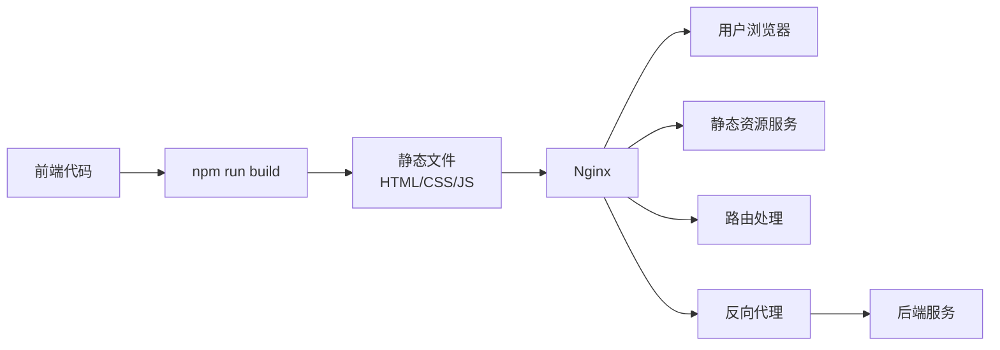

让我详细解释一下 Nginx 在前端部署中的作用：

### 1. Nginx 的主要作用

1. **静态文件服务器**
```nginx
location / {
    root /usr/share/nginx/html;  # 静态文件根目录
    index index.html;            # 默认首页
}
```
- 负责提供 HTML、CSS、JavaScript、图片等静态文件
- 比 Node.js 等应用服务器更高效地处理静态资源


2. **路由重写（SPA 必需）**
```nginx
location / {
    try_files $uri $uri/ /index.html;  # 将所有请求重定向到 index.html
}
```
- 对于 React/Vue 等单页应用（SPA）必需
- 确保刷新页面时不会 404


3. **缓存控制**
```nginx
# 静态资源缓存
location /static/ {
    expires 1y;                     # 缓存一年
    add_header Cache-Control "public";
}

# 动态内容不缓存
location / {
    add_header Cache-Control "no-cache";
}
```


4. **压缩响应**
```nginx
gzip on;
gzip_types text/plain text/css application/json application/javascript;
```
- 减小传输大小，提高加载速度


5. **反向代理**
```nginx
# API 请求转发
location /api/ {
    proxy_pass http://backend:3000/;
}
```
- 可以将 API 请求转发到后端服务
- 解决跨域问题


### 2. 为什么需要 Nginx？

1. **生产环境必需**
- React/Vue 开发环境用的是开发服务器（如 webpack-dev-server）
- 生产环境需要高效的静态文件服务器


2. **性能优化**
```nginx
# 启用压缩
gzip on;
# 缓存控制
expires 7d;
# 并发连接数配置
worker_connections 1024;
```


3. **安全性**
```nginx
# 隐藏服务器信息
server_tokens off;
# 添加安全头
add_header X-Frame-Options "SAMEORIGIN";
add_header X-XSS-Protection "1; mode=block";
```


### 3. 最小配置示例

```nginx
server {
    listen 80;
    server_name localhost;
    
    # 1. 静态文件服务
    root /usr/share/nginx/html;
    index index.html;

    # 2. SPA 路由支持
    location / {
        try_files $uri $uri/ /index.html;
    }

    # 3. 静态资源缓存
    location /static/ {
        expires 1y;
    }

    # 4. API 代理（如果需要）
    location /api/ {
        proxy_pass http://backend:3000/;
    }
}
```


### 4. 是否所有前端项目都需要 Nginx？

不是必需的，但强烈建议使用，原因如下：

1. **替代方案**
- 可以使用 Node.js 静态文件服务器
- 可以使用 Apache
- 可以直接使用云服务（如 S3）

2. **为什么选择 Nginx**
- 性能更好（专门优化过的静态文件服务）
- 配置灵活（路由、缓存、代理等）
- 资源占用少
- 生产环境验证充分

3. **什么时候可以不用 Nginx**
- 静态网站托管（如 GitHub Pages）
- 小型演示项目
- 使用其他专门的静态文件服务


### 5. 开发和生产环境的区别

1. **开发环境**
```bash
npm start  # 使用 webpack-dev-server
```
- 热重载
- 源码映射
- 开发服务器

2. **生产环境**
```bash
npm run build  # 构建静态文件
# 使用 Nginx 服务
```
- 文件压缩
- 缓存优化
- 高性能服务

需要我详细解释任何部分吗？


让我用一个简单的图来解释前端部署流程和 Nginx 的角色：



### 前端部署流程

1. **构建阶段**
```bash
# 1. 前端代码构建
npm run build

# 生成静态文件：
# - index.html
# - /static/js/*.js
# - /static/css/*.css
# - 图片等资源
```

2. **部署阶段**
```bash
# 2. 将构建文件复制到 Nginx 目录
/usr/share/nginx/html/
```

### Nginx 的核心作用

1. **静态文件服务器**
- 接收用户请求
- 提供静态文件（HTML、JS、CSS、图片）
- 处理文件压缩和缓存

2. **路由处理**
```nginx
location / {
    try_files $uri $uri/ /index.html;
}
```
- 处理 SPA（单页应用）的路由
- 所有路径都返回 index.html

3. **反向代理**
```nginx
location /api {
    proxy_pass http://backend:3000;
}
```
- 转发 API 请求到后端服务
- 解决跨域问题

### 为什么需要 Nginx？

想象一下没有 Nginx：
1. **直接访问静态文件**
   - 没有压缩
   - 没有缓存控制
   - 性能差

2. **刷新页面**
   - SPA 路由失效
   - 出现 404 错误

3. **API 请求**
   - 跨域问题
   - 需要额外配置

### 实际例子

假设用户访问你的网站：

1. **首次访问**
```
用户 -> Nginx -> index.html
               -> main.js
               -> style.css
```

2. **路由切换**
```
用户点击导航 -> Nginx -> 返回 index.html
React/Vue 路由 -> 显示对应组件
```

3. **API 调用**
```
前端 API 请求 -> Nginx -> 转发到后端
                      <- 返回数据
```

### 总结

Nginx 在前端部署中扮演：
1. **门面服务器**：处理所有用户请求
2. **资源管理器**：提供静态资源服务
3. **路由管理器**：确保 SPA 正常工作
4. **代理服务器**：处理 API 转发


让我介绍一下市面上常见的 Web 服务器和静态文件服务解决方案：

### 1. Apache HTTP Server
**特点：**
````apache
# Apache 配置示例
<VirtualHost *:80>
    DocumentRoot /var/www/html
    
    # SPA 路由支持
    <Directory "/var/www/html">
        RewriteEngine On
        RewriteBase /
        RewriteRule ^index\.html$ - [L]
        RewriteCond %{REQUEST_FILENAME} !-f
        RewriteCond %{REQUEST_FILENAME} !-d
        RewriteRule . /index.html [L]
    </Directory>
</VirtualHost>
````
- 老牌 Web 服务器
- 配置灵活但较复杂
- 资源占用较大
- 模块化设计

### 2. Caddy
**特点：**
````caddy
# Caddy 配置示例
example.com {
    root * /var/www/html
    try_files {path} /index.html
    file_server
    encode gzip
}
````
- 配置简单
- 自动 HTTPS
- 现代化设计
- 性能良好

### 3. Node.js 静态服务器
**特点：**
````javascript
// Express.js 示例
const express = require('express');
const app = express();

app.use(express.static('build'));
app.get('*', (req, res) => {
  res.sendFile(path.join(__dirname, 'build', 'index.html'));
});
````
- 开发和生产环境统一
- 可定制性强
- 资源占用较大
- 适合小型项目

### 4. 云服务托管
#### AWS S3 + CloudFront
**特点：**
````yaml
# AWS CloudFront 配置
Distribution:
  DefaultRootObject: index.html
  CustomErrorResponse:
    - ErrorCode: 404
      ResponseCode: 200
      ResponsePagePath: /index.html
````
- 高可用性
- 全球 CDN
- 按使用付费
- 无需维护服务器

#### Vercel/Netlify
**特点：**
````json
// vercel.json
{
  "routes": [
    { "handle": "filesystem" },
    { "src": "/(.*)", "dest": "/index.html" }
  ]
}
````
- 开箱即用
- 自动部署
- 全球 CDN
- 适合前端项目

### 5. Lighttpd
**特点：**
````lighttpd
# Lighttpd 配置
server.document-root = "/var/www/html"
url.rewrite-if-not-file = (
  "^/(.*)" => "/index.html"
)
````
- 轻量级
- 低资源占用
- 性能优秀
- 配置相对简单

### 对比分析

1. **性能对比**
- Nginx：★★★★★
- Apache：★★★★☆
- Caddy：★★★★☆
- Node.js：★★★☆☆
- 云服务：★★★★★

2. **配置难度**
- Nginx：★★★☆☆
- Apache：★★★★☆
- Caddy：★★☆☆☆
- Node.js：★★☆☆☆
- 云服务：★☆☆☆☆

3. **资源占用**
- Nginx：★☆☆☆☆
- Apache：★★★☆☆
- Caddy：★★☆☆☆
- Node.js：★★★★☆
- 云服务：N/A

4. **适用场景**
- Nginx：大中型项目，高并发
- Apache：传统企业应用
- Caddy：小型现代项目
- Node.js：开发环境，小型项目
- 云服务：无运维团队的项目

### 选择建议

1. **大型项目**
- 首选 Nginx
- 考虑云服务 + CDN

2. **中小型项目**
- Caddy
- Vercel/Netlify

3. **个人项目**
- GitHub Pages
- Vercel/Netlify

4. **企业项目**
- Nginx
- Apache（如果团队更熟悉）
